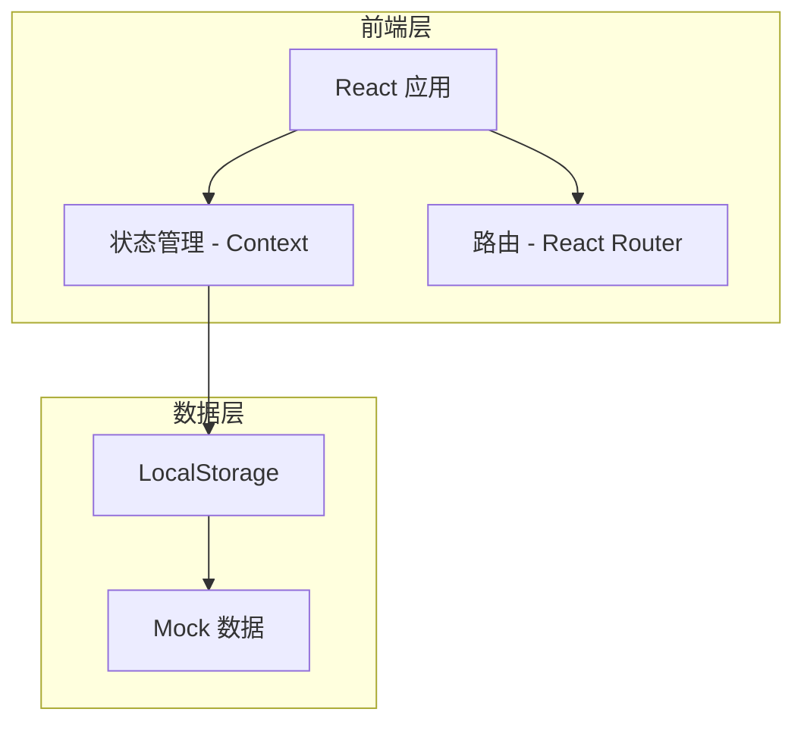
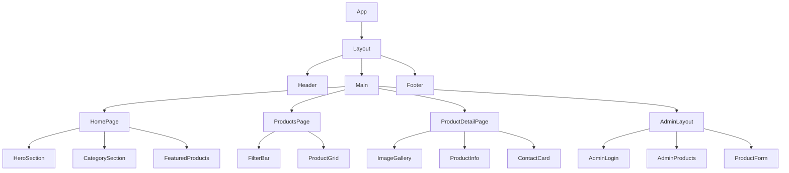

## 1. 架构设计



## 2. 技术说明

- **前端框架**: React@18 + TypeScript
- **样式方案**: Tailwind CSS@3
- **构建工具**: Vite
- **路由管理**: React Router@6
- **状态管理**: React Context + useReducer
- **数据存储**: LocalStorage (本地持久化)
- **图标库**: Lucide React

## 3. 路由定义

| 路由 | 用途 |
|------|------|
| `/` | 首页，展示产品分类和热门产品 |
| `/products` | 产品列表页，支持筛选和搜索 |
| `/products/:id` | 产品详情页 |
| `/admin` | 移动端管理入口 |
| `/admin/login` | 管理员登录页 |
| `/admin/products` | 产品管理列表 |
| `/admin/products/new` | 添加新产品 |
| `/admin/products/:id/edit` | 编辑产品 |

## 4. 数据模型

### 4.1 产品数据模型

```typescript
interface Product {
  id: string;
  name: string;
  category: 'excavator' | 'parts';
  description: string;
  images: string[];
  price: number | null;
  priceType: 'fixed' | 'negotiable';
  status: 'available' | 'sold';
  specifications: {
    brand?: string;
    model?: string;
    year?: number;
    hours?: number;
    [key: string]: string | number | undefined;
  };
  createdAt: string;
  updatedAt: string;
}
```

### 4.2 联系方式数据模型

```typescript
interface ContactInfo {
  phone: string;
  wechat: string;
  address: string;
  businessHours: string;
}
```

### 4.3 管理员数据模型

```typescript
interface Admin {
  username: string;
  password: string;
}
```

## 5. 数据存储结构

### 5.1 LocalStorage 键名

| 键名 | 数据类型 | 说明 |
|------|----------|------|
| `excavator_products` | Product[] | 产品列表数据 |
| `excavator_contact` | ContactInfo | 联系方式信息 |
| `excavator_admin` | Admin | 管理员登录信息 |
| `excavator_auth` | boolean | 登录状态 |

### 5.2 初始数据

系统将预置一些示例产品数据，方便用户了解系统功能。

## 6. 组件架构



## 7. 响应式设计断点

| 断点名称 | 屏幕宽度 | 布局说明 |
|----------|----------|----------|
| sm | < 640px | 移动端，单列布局 |
| md | 640px - 768px | 大屏手机，双列产品卡片 |
| lg | 768px - 1024px | 平板，三列产品卡片 |
| xl | > 1024px | 桌面端，四列产品卡片 |

## 8. 移动端管理功能

### 8.1 登录验证

- 简单的用户名密码验证
- 登录状态存储在 LocalStorage
- 支持退出登录功能

### 8.2 产品管理

- 添加产品：填写表单，上传图片（Base64存储）
- 编辑产品：修改已有产品信息
- 删除产品：确认后删除
- 图片管理：支持多图上传和删除

### 8.3 联系方式管理

- 修改联系电话
- 修改微信号
- 修改地址信息
